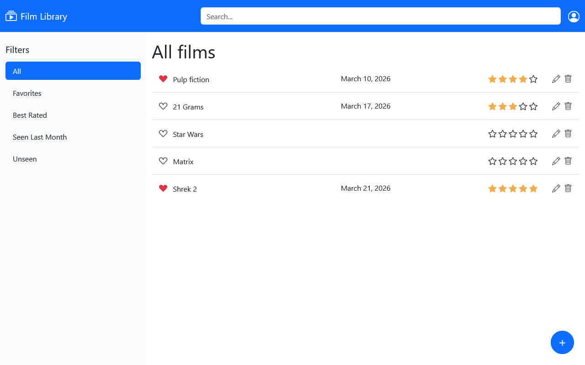

# 01UDF/01TXY Web Applications I (2025/2026)

## Lab 4: Getting Started with HTML and CSS

In this lab, you aim to create the Graphical User Interface (GUI) for the web-based Film Library using HTML, CSS, and Bootstrap.

Just like in previous labs, the Film Library contains different films, each with details like title, favorite status, watch date, and rating.

Remember, you're only designing the look and feel in this lab without implementing any functions. We are not using a database: fill the webpage with a few made-up films (around 4-5).

------------------------------------------------------------------------

## 1. Implement a web-based GUI of the Film Library

Develop a static webpage with the user interface to display the list of Films in the Film Library. Use the Bootstrap framework to structure and format the graphical components as described below:
- On the webpage's top is a navigation bar, including a Film Library logo, a search box, and an icon representing a logged-in user.
- Below the navigation bar, the webpage is structured in two columns: the first corresponds to a left sidebar occupying one-third of the total width, and the second corresponds to the main content, which occupies the remaining two-thirds.
- The left sidebar comprises buttons designed to apply the filters to the Film Library's films. Such planned filters are: "All," "Favorite," "Best rated," "Seen last month," and "Unseen." Implementing the filtering feature is not required in this lab (you must just display the name of the filters). 
- The main content has: 
    - A label indicating the title of the current filter.
    - The list of films resulting from applying the selected filter.
    - An element to create and add a new film to the Film Library. It is represented by the "+" symbol and positioned in the bottom right corner of the page.
- Each film in the list is displayed as follows:
    - The film's title.
    - An element indicating whether the film is a favorite (☑) or not (☐).
    - The film's watch date is in the format "Month D, Yr." (e.g., "March 14, 2026"), if available.
    - The film's rating is expressed using one to five stars. If no rating is assigned, display five empty stars.

Use the following screenshot as a reference:

## 2. Optional: Implement the responsive version of the web-based GUI 

As an optional exercise, you can exploit the responsive features offered by the Bootstrap framework so that if the webpage is ever displayed on a smartphone screen, the left sidebar and the search box should collapse (hide). All the other components should be re-arranged to fit the screen width.

Use the following screenshot as a reference:

### Notes:

1. You can verify you have written a correct HTML page using the W3C validator:
https://validator.w3.org/ 
2. Use the Bootstrap framework and its components to implement the static webpage. Specifically, we are going to use version 5.3 (the same version used by React):
https://getbootstrap.com/docs/5.3/getting-started/introduction/ 
3. Feel free to create a separate CSS file to customize the appearance of your website.
4. You can find several icons (like the FilmLibrary logo) on the Bootstrap Icons site (https://icons.getbootstrap.com). Specifically, after selecting an icon, you can follow one of these approaches:
    - Importing the bootstrap icons CSS:
        - In your web page header, add the link to the Bootstrap Icons stylesheet, which you can find here: https://icons.getbootstrap.com/#install 
        - Include the icons in your web page using the icon tag: `<i class="selected_icon_name_here"></i>`
    - Importing its HTML: 
        - Copy and paste the HTML section of the icon into your HTML page.
    - Download the icon:
        - After saving the icon (inside the folder of your project), import it using the image tag: ``